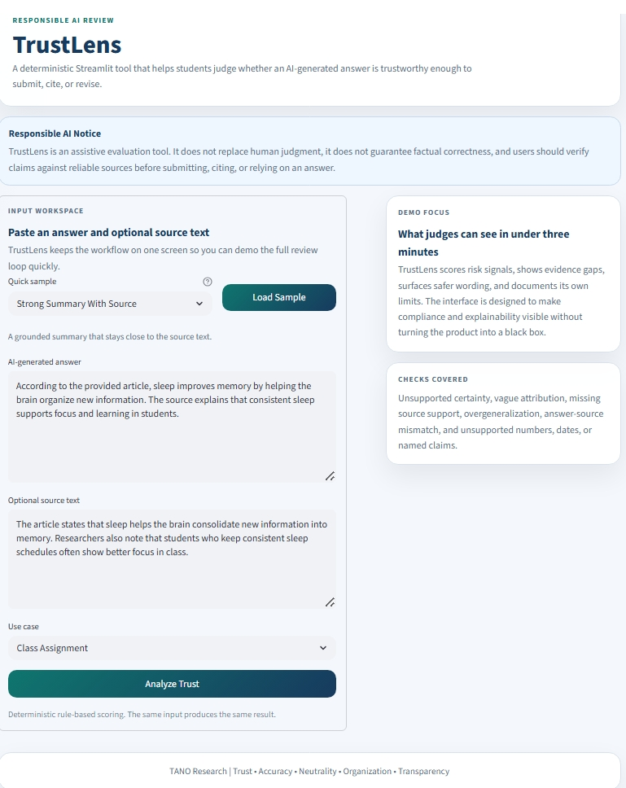
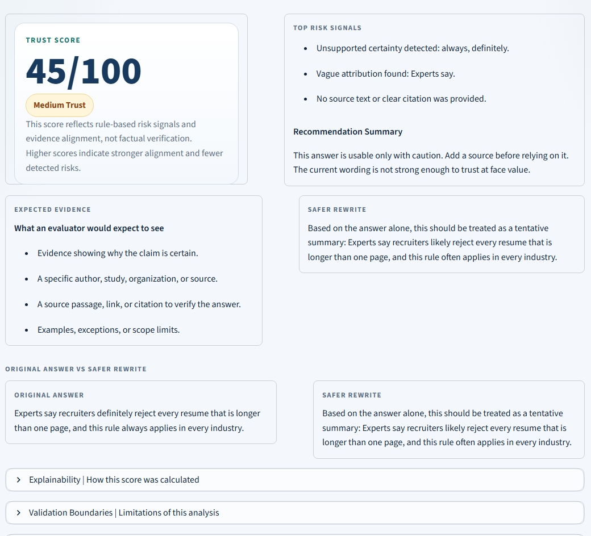
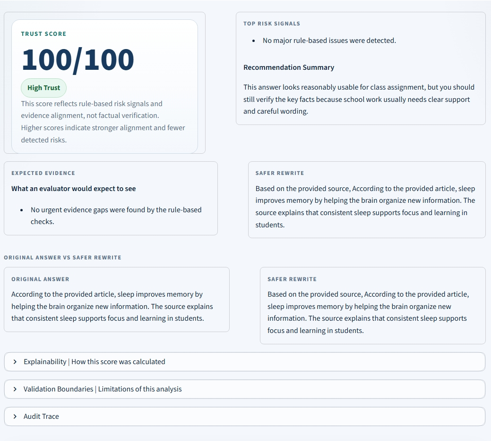

# TrustLens

🚨 AI is powerful — but not always trustworthy.

TrustLens helps students evaluate whether an AI-generated answer is safe to submit, cite, or rely on.

**TrustLens shifts AI usage from blind trust to informed decision-making.**

---

## 🔗 Quick Access

🌐 Live App: https://trustlens-tano.streamlit.app/  
🎥 Demo Video: (assets/TrustLensVideo.webm)  
📦 Repository: https://github.com/eliza-ochoa/TrustLens  

---

## 🧠 What is TrustLens?

TrustLens is a deterministic Streamlit app that helps students judge whether an AI-generated answer is trustworthy enough to submit, cite, or revise.

Instead of generating more content, TrustLens evaluates existing AI outputs using transparent, rule-based logic and provides actionable insights.

---

## ⚠️ Why It Matters

AI-generated answers often sound confident and complete, even when they are unsupported or misleading. Students frequently rely on these responses without verifying them.

TrustLens introduces a lightweight, explainable review step that helps users detect risk signals, evaluate evidence alignment, and revise unsafe outputs before using them in academic or real-world contexts.

---

## ⚡ Features

TrustLens focuses on fast, transparent evaluation rather than content generation.

- 📊 **Prominent Trust Score** with High, Medium, or Low Trust badge  
- 🔎 **Clear review sections:**
  - Top Concerns  
  - What an evaluator would expect to see  
  - Safer Rewrite  
  - Audit Trace  
- ⚠️ **Deterministic rule-based checks:**
  - unsupported certainty  
  - vague attribution  
  - missing source support  
  - overgeneralization  
  - mismatch between answer and source text  
  - unsupported numbers, dates, and named claims  
- 🧠 **Plain-English Explainability section**  
- ⚠️ **Validation Boundaries section**  
- 🛡️ **Responsible AI banner + structured auditability**

---

## 📊 Transparency Note

> This score reflects rule-based risk signals and evidence alignment, not factual verification.

---

## 🧪 Demo

🎥 Demo Video: (assets/TrustLensVideo.webm)  
🌐 Live App: https://trustlens-tano.streamlit.app/  

The demo shows how TrustLens evaluates a weak AI answer, highlights risk signals, and generates a safer rewrite in seconds.

---

## 📸 Screenshots

| Home Screen | Low Trust Example | High Trust Example |
|------------|------------------|------------------|
|  |  |  |

---

## 🛠️ Built With Codex

This project was built and refined using Codex for:

- scaffolding  
- debugging  
- scoring logic refinement  
- UI iteration  
- final polish and documentation  

---

## 🛡️ Compliance-by-Design

TrustLens is designed to make responsible AI use visible in the product itself.

- **Transparency** – scoring is deterministic and rule-based  
- **Explainability** – users can see how results were generated  
- **Safety** – clear disclaimers and limitations are provided  
- **Validation Boundaries** – no external or live web verification  
- **Auditability** – traceable signals, rules, and score drivers  
- **Responsible Use** – encourages verification against reliable sources  

TrustLens demonstrates how responsible AI principles can be embedded directly into user-facing tools.

---

## ▶️ Usage

1. Paste an AI-generated answer  
2. (Optional) Add source text  
3. Select a context  
4. Click **Analyze Answer Trust**

TrustLens will:
- assign a trust score  
- highlight risk signals  
- show expected evidence  
- generate a safer rewrite  

---

## 💻 Run Locally

```bash
pip install -r requirements.txt
streamlit run app.py
```

## Future Improvements

- Sentence-level evidence highlighting
- Optional file upload for source text
- Exportable review summary for classroom use
- More sample scenarios for live demos

## Who It's For

- Students using AI for assignments or research
- Anyone who wants to validate AI-generated content before relying on it
- Users interested in responsible and transparent AI usage

TrustLens demonstrates how responsible AI principles can be embedded directly into user-facing tools.

---

**TANO Research**  
Trust • Accuracy • Neutrality • Organization • Transparency  
“Exploring Possibilities Everywhere”
